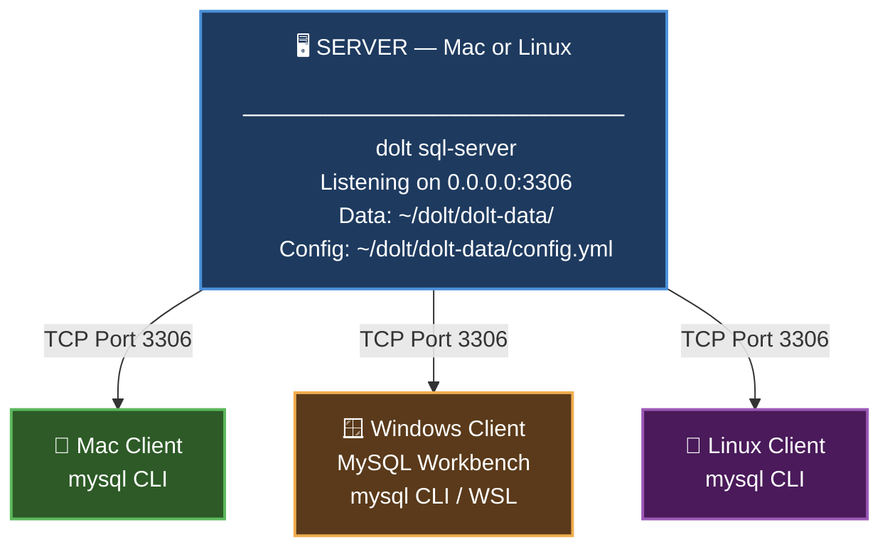
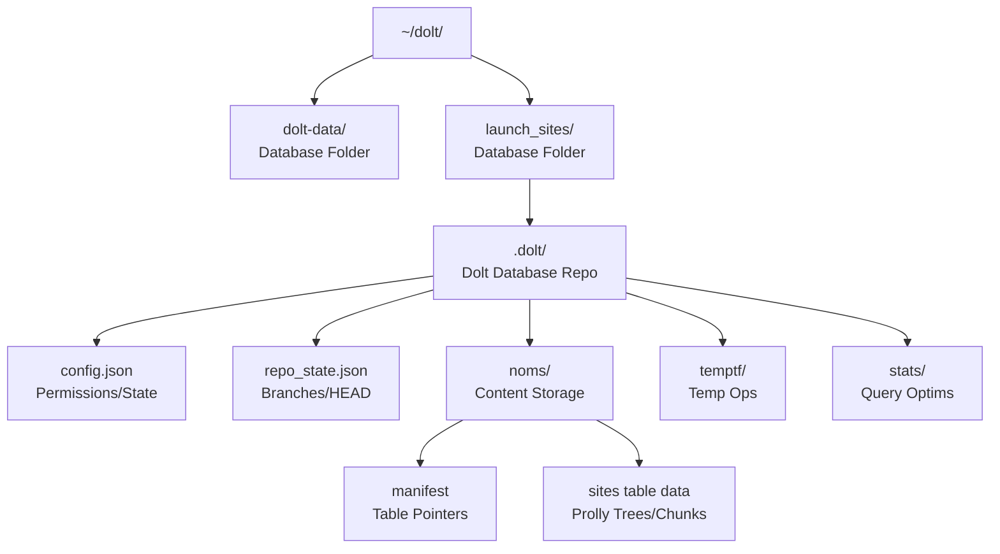
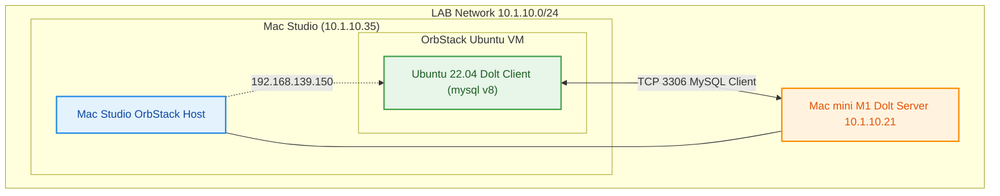

# Dolt Getting Started Guide
### Simple Remote Access Setup — No Encryption
*For Network Engineers New to Databases and Dolt*

> **Tested with Dolt version 1.83.0** on macOS and Linux. All commands and config options in this guide are validated against this version.

---

## Table of Contents

1. [What is Dolt?](#1-what-is-dolt)
2. [Architecture Overview](#2-architecture-overview)
3. [Installing Dolt on the Server (Mac or Linux)](#3-installing-dolt-on-the-server-mac-or-linux)
4. [Creating the config.yml File](#4-creating-the-configyml-file)
5. [Initializing the Dolt Server](#5-initializing-the-dolt-server)
6. [Creating an Admin User (Non-Root)](#6-creating-an-admin-user-non-root)
7. [Starting the Dolt SQL Server](#7-starting-the-dolt-sql-server)
8. [Client Tools — What to Install and Where to Get Them](#8-client-tools--what-to-install-and-where-to-get-them)
9. [Connecting Remotely from a Client](#9-connecting-remotely-from-a-client)
10. [Creating the Launch Sites Database and Table](#10-creating-the-launch-sites-database-and-table)
11. [Inserting Sample Data](#11-inserting-sample-data)

**Reference**

1. [Quick Reference Cheat Sheet](#quick-reference-cheat-sheet)
2. [Troubleshooting](#troubleshooting)
   - [Can't connect from remote client](#cant-connect-from-remote-client)
   - ["Access denied for user" error](#access-denied-for-user-error)
   - [Server won't start](#server-wont-start)
   - [DBeaver shows "Public Key Retrieval is not allowed"](#dbeaver-shows-public-key-retrieval-is-not-allowed)
   - ["secure_file_priv is set to empty string" warning](#secure_file_priv-is-set-to-empty-string-warning)
   - ["user and password are no longer supported" warning](#user-and-password-are-no-longer-supported-warning)
   - [Server log shows "Got unhandled packet" errors](#server-log-shows-got-unhandled-packet-errors)
   - [How to confirm a connection is still alive](#how-to-confirm-a-connection-is-still-alive)
   - [Reducing server log noise](#reducing-server-log-noise)
   - [Config file errors](#config-file-errors)
3. [Directory Structure Details]()

---

## 1. What is Dolt?

**Dolt** is a SQL database, like MySQL or PostgreSQL,  but with one superpower: **it works like Git**. 

Every change you make to data is tracked, versioned, and can be rolled back, branched, or merged, just like source code.

For a network engineer, think of it this way:

> Dolt is to a database what Git is to a config file — every change has a history, you can diff before/after, branch, and you can roll back a bad push.

**Key facts:**

- Dolt speaks **MySQL-compatible SQL**, so any MySQL client works with it
- It runs as a **server process** (like a network daemon) on a host, listening on a TCP port
- Remote clients connect over the network using standard MySQL protocol on **port 3306** (default)
- No special agent or driver needed on the client side — just a MySQL-compatible client

> [!WARNING]
>
> Dolt is under active development and there seem to be "breaking" changes in the CLI and set up more often than most products (NOT in the database) so keep that in mind.


---

## 2. Architecture Overview



> **View or edit this diagram live at:** https://mermaid.live — paste the code block above (without the backticks) into the editor.

> **Firewall note:** Open TCP port 3306 inbound on the server host. If you have a host firewall (ufw, firewalld, macOS firewall), allow port 3306 from your client subnet. If you change the default port in `config.yml`, substitute your chosen port number everywhere `3306` appears in firewall and connection commands.

### 2.1 Directory vs Database vs Table(s)

## File Structure

Recommended layout uses a top-level directory like `~/dolt/` or `/dolt/` containing subfolders for each database:

Dolt supports multiple databases as sibling directories under the parent folder, where each database folder (e.g., `launch_sites` and `dolt-data`) contains its own `.dolt/` repo. Adding `dolt-data` at the same level creates another database alongside `launch_sites`, served together by `dolt sql-server` started in the parent.

## Updated File Structure

```
text
~/dolt/                  # Parent folder for databases
├── dolt-data/           # Additional database folder
└── launch_sites/        # Database folder
```

- `dolt-data/` acts as a peer database; initialize with `cd ~/dolt/dolt-data && dolt init`.
- No subfolders shown per request; run `dolt sql-server` from `~/dolt/` to serve both.

```
text
~/dolt/                  # Parent folder for databases
└── launch_sites/        # Database folder (named after DB)
    └── .dolt/           # Hidden Dolt metadata dir (not a table)
        ├── config.json  # Config and permissions
        ├── repo_state.json # Git-like state (HEAD, branches)
        ├── noms/        # Core data storage (content-addressed chunks)
        │   ├── manifest # Points to table data
        │   └── ...      # Table files post-GC
        ├── temptf/      # Temp files for ops
        └── stats/       # Table query stats
```

- **Directory (`launch_sites/`)**: Human-readable container; its name becomes the DB name when using `dolt sql`.
- **Database (`.dolt/`)**: Internal Git-like repo with versioned schema/data; serves via `dolt sql-server`.
- **Table (`sites`)**: SQL table inside the DB, stored as Prolly Trees in `noms/`; query via `USE launch_sites; SELECT * FROM sites;`.




While many databases can be served using this methodology, we will keep it simple and only serve up a database in a particular directory.

```
mysql> SHOW DATABASES;
+--------------------------+
| Database                 |
+--------------------------+
| dolt-data                |
| factory_wifi             |
| information_schema       |
| launch-sites             |
| my_db                    |
| my_dolt_db               |
| mysql                    |
| network_automation_tools |
+--------------------------+
8 rows in set (0.00 sec)

mysql>
```


### 2.2 Environment

### Server

| Item | Version              |
| ---- | -------------------- |
| Dolt | dolt version 1.83.0+ |


### Server

| Item   | Version                                            |
| ------ | -------------------------------------------------- |
| Python | 3.10 +                                             |
| uv     | uv 0.10.7 (08ab1a344 2026-02-27)                   |
| Dolt   | dolt version 1.83.0                                |
| mysql  | mysql  Ver 8.4.8 for macos15.7 on arm64 (Homebrew) |





---

## 3. Installing Dolt on the Server (Mac or Linux)

Dolt is a single self-contained binary. No package manager dependencies, no runtime, no Python required.

[Complete installation instructions](https://docs.dolthub.com/introduction/installation) can be found [here](https://docs.dolthub.com/introduction/installation).   In this example, we are building the server on a Mac or Linux system.

### macOS (Intel or Apple Silicon)

Open **Terminal** and run:

```bash
brew install dolt
```

If you don't have Homebrew installed first:
```bash
/bin/bash -c "$(curl -fsSL https://raw.githubusercontent.com/Homebrew/install/HEAD/install.sh)"
```

Then verify:
```bash
dolt version
```

### Linux (All Distributions)

```bash
curl -L https://github.com/dolthub/dolt/releases/latest/download/install.sh | bash
```

This installs the `dolt` binary to `/usr/local/bin`. Verify with:
```bash
dolt version
```

You should see something like: `dolt version 1.83.0`

> This guide is tested and validated against **dolt version 1.83.0**. If your version differs significantly, some config field names or SQL procedure signatures may vary slightly.

### Initial Dolt Setup (Commit Author Identity)

Like Git, Dolt records an **author** on every commit. If you do not configure it, commits may fail or may use an identity you didn’t intend.

Set these values once per machine (recommended) using `--global`:

```bash
dolt config --global --add user.name "Your Name"
dolt config --global --add user.email "you@example.com"
```

Or, if you want the identity to apply only to a single Dolt database directory (repo-local), run the same commands **without** `--global` from inside the database directory (the folder that contains `.dolt/`).

Verify what Dolt is configured to use:

```bash
# Show all config values (including user.name / user.email)
dolt config --global --list

# If you're inside a database directory, this also shows repo-local overrides
dolt config --list
```

Confirm the author recorded on a commit:

```bash
# After you make your first commit, the log will show the commit author
dolt log -n 1
```

### Create a Dedicated Directory for Your Data

Dolt is designed to have a **parent directory** that acts as a container, under which each Dolt database instance lives in its own subdirectory. This makes it easy to run multiple independent databases on the same server.

The structure we'll use throughout this guide:

```
~/dolt/                   ← parent container for all dolt instances
└── dolt-data/            ← this specific server instance's data directory
    └── config.yml        ← server configuration
    └── .dolt/            ← internal dolt engine store (auto-created)
```

Create both directories:

```bash
mkdir -p ~/dolt/dolt-data
cd ~/dolt/dolt-data
```

> All commands from here on assume you are working from `~/dolt/dolt-data` unless otherwise noted. If you prefer an absolute path instead of `~`, use `/home/yourusername/dolt/dolt-data` on Linux or `/Users/yourusername/dolt/dolt-data` on macOS.

---

## 4. Creating the config.yml File

Dolt uses a YAML configuration file to control server behavior — host binding, port, credentials, logging, etc. Think of it like `sshd_config` or a router service config block.

Create the file:

```bash
nano ~/dolt/dolt-data/config.yml
```

> **Dolt v1.83.0 note:** The `user` and `password` fields previously supported in `config.yml` are now **deprecated and will cause a warning** if present. Similarly, `secure_file_priv` and `databases` are **not valid config.yml fields** in v1.83.0 and will cause a parse error if included. The config below contains only fields confirmed valid for this version.

Paste in the following **bare-bones configuration**:

```yaml
# ============================================================
# Dolt SQL Server Configuration
# Simple No-Encryption Setup
# Tested with Dolt v1.83.0
# ============================================================

log_level: info

behavior:
  read_only: false
  autocommit: true

listener:
  host: "0.0.0.0"          # Listen on all interfaces for remote access
  port: 3306                # Default MySQL port — change if needed (e.g., 3307)
  max_connections: 10
  read_timeout_millis: 30000
  write_timeout_millis: 30000
  tls_key: ""               # No TLS key — plaintext mode
  tls_cert: ""              # No TLS cert — plaintext mode
  require_secure_transport: false # TLS not required - LAB Only!
  
performance:
  query_parallelism: 0

data_dir: "."               # Use current directory as the data root
```

Save and exit: `Ctrl+X`, then `Y`, then `Enter`.

**What each section means:**

| Setting | What it does |
|---|---|
| `log_level: info` | Log informational messages (like `logging buffered informational` on IOS) |
| `behavior.autocommit: true` | Each SQL statement saves automatically — safe default |
| `listener.host: "0.0.0.0"` | Accept connections on all network interfaces |
| `listener.port: 3306` | Standard MySQL port — change to any free port (e.g., `3307`) if 3306 is in use; update your firewall rule and client connection to match |
| `tls_key / tls_cert: ""` | Empty strings explicitly disable TLS — this is plaintext / no-encryption mode |
| `max_connections: 10` | Maximum simultaneous client connections |

---

## 5. Initializing the Dolt Server

Before starting the server for the first time, you need to initialize the data directory. This is like formatting a drive or initializing a RAID array.

```bash
cd ~/dolt/dolt-data
dolt init
```

You'll see output like:
```
Successfully initialized dolt data repository.
```

> **Note:** This creates a hidden `.dolt` directory inside `~/dolt/dolt-data`. Don't delete it — it's the database engine's internal store.

---

## 6. Creating an Admin User (Non-Root)

You have two options for creating the admin user. **Option A** uses the Dolt built-in SQL shell — no extra tools needed. **Option B** uses the `mysql` CLI client if you already have it installed. Both produce identical results — pick whichever is more convenient.

---

### Option A — Dolt CLI (No Extra Tools Required) ✅ Recommended

Dolt v1.83.0 includes a built-in `dolt sql` command that lets you run SQL directly against the data directory **without starting a server first**. No MySQL client needed.

#### Step 1 — Open the Dolt interactive SQL shell

```bash
cd ~/dolt/dolt-data
dolt sql
```

You will see a prompt like:
```
dolt-data> 
```

This is a full interactive SQL shell — type commands exactly as you would if you had connected remotely with a MySQL client.

#### Step 2 — Create the admin user

Type each line and press Enter:

```sql
CREATE USER 'dbadmin'@'%' IDENTIFIED BY 'SecurePass456!';
GRANT ALL PRIVILEGES ON *.* TO 'dbadmin'@'%' WITH GRANT OPTION;
FLUSH PRIVILEGES;
SELECT User, Host FROM mysql.user;
```

You should see a table confirming `dbadmin` exists with host `%`. Then exit the shell:

```sql
EXIT;
```

> **Note:** The `user:` / `password:` fields in `config.yml` are deprecated in v1.83.0 — **do not add them**. Dolt manages all user accounts exclusively via SQL.

---

###  Option B — Connect via mysql CLI (If mysql Is Installed)

Use this method if you already have the `mysql` client available on the server.

If `mysql` isn't installed, install it first:

- **macOS:** `brew install mysql-client` then: `echo 'export PATH="/opt/homebrew/opt/mysql-client/bin:$PATH"' >> ~/.zshrc && source ~/.zshrc`
- **Ubuntu/Debian:** `sudo apt install mysql-client -y`
- **RHEL/CentOS/Rocky:** `sudo yum install mysql -y`

#### Step 1 — Start the server temporarily

```bash
cd ~/dolt/dolt-data
dolt sql-server --config config.yml &
```

The `&` runs it in the background. Wait 2–3 seconds for it to start.

#### Step 2 — Connect locally as root

```bash
mysql -h 127.0.0.1 -P 3306 -u root --password=""
```

#### Step 3 — Create your admin user

At the `mysql>` prompt, run these commands:

```sql
-- Create a new admin user accessible from any host
CREATE USER 'dbadmin'@'%' IDENTIFIED BY 'SecurePass456!';

-- Grant full privileges
GRANT ALL PRIVILEGES ON *.* TO 'dbadmin'@'%' WITH GRANT OPTION;

-- Apply the changes
FLUSH PRIVILEGES;

-- Confirm the user was created
SELECT User, Host FROM mysql.user;

-- Exit
EXIT;
```

#### Step 4 — Stop the temporary server

```bash
kill $(pgrep -f "dolt sql-server")
```

> **Password note:** Replace `SecurePass456!` with a strong password of your choosing throughout this guide.
> The `'%'` wildcard means this user can connect from any IP address. For tighter security, replace `%` with a specific IP or subnet like `'192.168.1.%'`.
> User accounts are managed exclusively via SQL in Dolt v1.83.0 — there is no `user:` or `password:` field to update in `config.yml`.

---

## 7. Starting the Dolt SQL Server

Now start the server properly. For ongoing use, you can run it in the foreground (in a `screen` or `tmux` session) or set it up as a system service.

### Option A — Foreground with screen (Recommended for Getting Started)

Install screen if needed:
- **macOS:** `brew install screen`
- **Linux:** `sudo apt install screen -y` or `sudo yum install screen -y`

```bash
screen -S dolt-server
cd ~/dolt/dolt-data
dolt sql-server --config config.yml
```

You'll see:
```
Starting server with Config HP="0.0.0.0:3306"|T="28800000"|R="false"|L="info"
```

Detach from the screen session (server keeps running): `Ctrl+A`, then `D`

To reattach later: `screen -r dolt-server`

### Option B — Background process (Quick and Simple)

```bash
cd ~/dolt/dolt-data
nohup dolt sql-server --config config.yml > dolt.log 2>&1 &
echo $! > dolt.pid
```

Check it's running:
```bash
tail -f ~/dolt/dolt-data/dolt.log
```

Stop it later with:
```bash
kill $(cat ~/dolt/dolt-data/dolt.pid)
```

### Verify the server is listening

**macOS:**
```bash
# Check if dolt is running
pgrep -a dolt

# Check what port dolt is listening on
lsof -nP -iTCP:3306 -sTCP:LISTEN
```

**Linux:**
```bash
# Check if dolt is running
pgrep -a dolt

# Check the listening port
ss -tlnp | grep 3306
```

You should see output referencing `*:3306` or `0.0.0.0:3306` — the server is listening on all interfaces.

> **Note:** `ss` is Linux-only and does not exist on macOS. `netstat` on macOS uses different flags than Linux — use `lsof` instead. `pgrep -a dolt` works on both platforms.

### Firewall — Open Port 3306

**Ubuntu/Debian (ufw):**
```bash
sudo ufw allow 3306/tcp
sudo ufw status
```

**RHEL/CentOS/Rocky (firewalld):**
```bash
sudo firewall-cmd --permanent --add-port=3306/tcp
sudo firewall-cmd --reload
```

**macOS:** Go to System Settings → Network → Firewall → Options, and allow incoming connections for dolt, or disable the firewall for lab use.

> If you changed the default port from `3306` to something else in `config.yml`, substitute your chosen port in all firewall commands above.

---

## 8. Client Tools — What to Install and Where to Get Them

Since Dolt speaks MySQL protocol, you can use **any MySQL-compatible client**. Below are the best options for each platform.

### MySQL Workbench — Official MySQL GUI Client

A good alternative with a clean interface.

**Download:** https://dev.mysql.com/downloads/workbench/

- **macOS:** Download the `.dmg` and drag to Applications
- **Windows:** Download the `.msi` installer and run it
- **Linux:** Available via package manager or `.deb`/`.rpm` from the download page

---

### Command-Line mysql Client — For Terminal Users

For those comfortable with the terminal (network engineers often are), the `mysql` CLI is fast and scriptable.

#### macOS
```bash
brew install mysql-client
echo 'export PATH="/opt/homebrew/opt/mysql-client/bin:$PATH"' >> ~/.zshrc
source ~/.zshrc
```

#### Windows

1. Download MySQL Community Server from https://dev.mysql.com/downloads/mysql/
2. Run the installer — select **Custom** and choose only **MySQL Client** to keep it minimal
3. Or use the Windows Subsystem for Linux (WSL): `sudo apt install mysql-client -y`

#### Linux
```bash
# Ubuntu/Debian
sudo apt install mysql-client -y

# RHEL/CentOS/Rocky
sudo yum install mysql -y
```

---

## 9. Connecting Remotely from a Client

Replace `SERVER_IP` with the actual IP address of your Dolt server.

### Using MySQL Workbench

1. Open MySQL Workbench
2. Click the **+** icon next to "MySQL Connections"
3. Fill in:
   - Connection Name: `Dolt Server`
   - Hostname: `SERVER_IP`
   - Port: `3306`
   - Username: `dbadmin`
4. Click **Store in Vault** to save your password
5. Click **Test Connection**, then **OK**

### Using the mysql CLI (Terminal)

```bash
mysql -h SERVER_IP -P 3306 -u dbadmin -p
```

Enter your password when prompted. You'll land at the `mysql>` prompt.

---

## 10. Creating the Launch Sites Database and Table

> [!TIP]
>
> This shows you how to create the database, and launch_sites table with the schema shown below.  I recommend you review this and try it manually.  Once you are comfortable, shift over to the DOLT_DB_Workflow.md file to use a python script to manage the creating, update, destruction, and restore of your Dolt database.

Once connected (via any client or the `dolt sql` cli), run the following SQL. In a GUI like DBeaver, open a **SQL Editor** window (usually Ctrl+Enter or the SQL Editor button). In the CLI, type these at the `mysql>` prompt.

### Create the Database

```sql
CREATE DATABASE launch_sites;
USE launch_sites;
```

### Create the Table

```sql
CREATE TABLE sites (
    idx              INT           NOT NULL AUTO_INCREMENT,
    common_name      VARCHAR(100)  NOT NULL,
    lat              DECIMAL(9,6)  NOT NULL,
    lon              DECIMAL(9,6)  NOT NULL,
    country          VARCHAR(100)  NOT NULL,
    mgmt_org         VARCHAR(150),
    site_type        VARCHAR(50),
    status           VARCHAR(20)   DEFAULT 'Active',
    notes            TEXT,
    PRIMARY KEY (idx)
);
```

**Column reference:**

| Column | Type | Purpose |
|---|---|---|
| `idx` | INT AUTO_INCREMENT | Unique row ID, auto-assigned |
| `common_name` | VARCHAR(100) | Human-readable site name |
| `lat` | DECIMAL(9,6) | Latitude (e.g., `28.573469`) |
| `lon` | DECIMAL(9,6) | Longitude (e.g., `-80.651070`) |
| `country` | VARCHAR(100) | Country name |
| `mgmt_org` | VARCHAR(150) | Managing organization |
| `site_type` | VARCHAR(50) | e.g., "Orbital", "Suborbital", "Spaceport" |
| `status` | VARCHAR(20) | Active, Inactive, Under Construction |
| `notes` | TEXT | Free-form notes |

Verify the table was created:
```sql
DESCRIBE sites;
SHOW TABLES;
```

---

## 11. Inserting Sample Data

> [!NOTE]
>
> The data below can be found in the `launch_sites_initial.csv` file.


```sql
INSERT INTO sites (common_name, lat, lon, country, mgmt_org, site_type, status, notes)
VALUES
    ('Kennedy Space Center LC-39A',   28.608389,  -80.604333, 'United States', 'NASA / SpaceX',          'Orbital',     'Active',   'Historic Apollo and Shuttle pad, now used by SpaceX Falcon 9/Heavy'),
    ('Baikonur Cosmodrome',           45.920000,   63.342000, 'Kazakhstan',    'Roscosmos',               'Orbital',     'Active',   'Oldest and largest operational launch site in the world'),
    ('Vandenberg SFB SLC-4E',         34.632000, -120.611000, 'United States', 'SpaceX',                  'Orbital',     'Active',   'West coast polar orbit launch pad'),
    ('Guiana Space Centre (Kourou)',    5.236000,  -52.769000, 'French Guiana', 'ESA / ArianeGroup',       'Orbital',     'Active',   'Primary ESA launch site near the equator'),
    ('Jiuquan Satellite Launch Center',40.960000,  100.291000, 'China',         'CASC / CNSA',             'Orbital',     'Active',   'China''s first and oldest space launch center'),
    ('Satish Dhawan Space Centre',     13.733000,   80.235000, 'India',         'ISRO',                    'Orbital',     'Active',   'Primary Indian space launch facility on Sriharikota island'),
    ('Tanegashima Space Center',       30.400000,  130.970000, 'Japan',         'JAXA',                    'Orbital',     'Active',   'Japan''s largest rocket launch complex'),
    ('Mahia Peninsula Launch Complex', -39.260000, 177.864000, 'New Zealand',   'Rocket Lab',              'Orbital',     'Active',   'Rocket Lab''s private orbital launch site'),
    ('SpaceX Starbase (Boca Chica)',    25.997000,  -97.155000, 'United States', 'SpaceX',                  'Orbital',     'Active',   'Starship development and launch facility'),
    ('Plesetsk Cosmodrome',            62.925000,   40.577000, 'Russia',        'Russian Ministry of Defence', 'Orbital', 'Active',   'Russia''s primary military launch site'),
    ('Wenchang Space Launch Site',     19.615000,  110.951000, 'China',         'CASC / CNSA',             'Orbital',     'Active',   'China''s newest and most modern launch center'),
    ('Palmachim Airbase',              31.894000,   34.690000, 'Israel',        'IAI / Israeli MoD',       'Orbital',     'Active',   'Israeli launch site, launches westward over Mediterranean'),
    ('Cape Canaveral SFS SLC-41',      28.583000,  -80.583000, 'United States', 'ULA',                     'Orbital',     'Active',   'Atlas V and Vulcan launch pad');
```

### Verify the Data

```sql
-- See all rows
SELECT * FROM sites;

-- Count by country
SELECT country, COUNT(*) AS site_count
FROM sites
GROUP BY country
ORDER BY site_count DESC;

-- Find active US sites
SELECT common_name, lat, lon, mgmt_org
FROM sites
WHERE country = 'United States' AND status = 'Active';

-- Find sites near the equator (within 10 degrees)
SELECT common_name, country, lat
FROM sites
WHERE lat BETWEEN -10 AND 10
ORDER BY lat;
```

### Commit the Data (Dolt's Superpower)

Dolt lets you version-control your data like Git:

```sql
-- Stage all changes
CALL dolt_add('-A');

-- Commit with a message
CALL dolt_commit('-m', 'Initial load: 13 global launch sites');

-- View the commit log
SELECT * FROM dolt_log LIMIT 10;
```

#### Review the changes to the 'sites' table.

```
SELECT diff_type,
       COALESCE(to_common_name, from_common_name) AS common_name,
       from_status, to_status
FROM dolt_diff('HEAD~1', 'HEAD', 'sites');
```

### If you want “just inserts” (added rows)

```
SELECT *
FROM dolt_diff('HEAD~1', 'HEAD', 'sites')
WHERE diff_type = 'added';
```

### Next Steps

You should have enough here to make changes, commits, and check your progress.

To get familar with using Python for this, please go to the  DOLT_DB_Workflow.md file.

---

# Reference Information

## Quick Reference Cheat Sheet

### Server Commands (run on the server host)

```bash
# Start the server
cd ~/dolt-data && dolt sql-server --config config.yml

# Start in background
nohup dolt sql-server --config config.yml > dolt.log 2>&1 & echo $! > dolt.pid

# Stop the server
kill $(cat ~/dolt/dolt-data/dolt.pid)

# Check if server is running (macOS and Linux)
pgrep -a dolt

# Check listening port — macOS
lsof -nP -iTCP:3306 -sTCP:LISTEN

# Check listening port — Linux
ss -tlnp | grep 3306

# View live logs (macOS and Linux)
tail -f ~/dolt/dolt-data/dolt.log
```

### Connect from CLI (Client or Server)

```bash
# Connect to remote server
mysql -h SERVER_IP -P 3306 -u dbadmin -p

# Connect locally on the server
mysql -h 127.0.0.1 -P 3306 -u dbadmin -p
```

### Essential SQL Commands

```sql
-- List all databases
SHOW DATABASES;

-- Switch to a database
USE launch_sites;

-- List tables
SHOW TABLES;

-- Describe a table's schema
DESCRIBE sites;

-- Select all rows
SELECT * FROM sites;

-- Add a new column
ALTER TABLE sites ADD COLUMN elevation_m INT;

-- Insert a row
INSERT INTO sites (common_name, lat, lon, country, mgmt_org, site_type)
VALUES ('My New Site', 0.000000, 0.000000, 'Country', 'Org Name', 'Orbital');

-- Update a row
UPDATE sites SET status = 'Inactive' WHERE idx = 2;

-- Delete a row
DELETE FROM sites WHERE idx = 99;
```

### Dolt Version Control Commands (SQL)

```sql
-- Stage all changes
CALL dolt_add('-A');

-- Commit changes
CALL dolt_commit('-m', 'Your commit message here');

-- View commit history
SELECT * FROM dolt_log;

-- View what changed (diff)
SELECT * FROM dolt_diff_sites;

-- Roll back uncommitted changes
CALL dolt_reset('--hard');
```

---

## Troubleshooting

---

### Can't connect from remote client

- Verify the server is running *(macOS and Linux):* `pgrep -a dolt`
- Verify it's listening on all interfaces:
  - **macOS:** `lsof -nP -iTCP:3306 -sTCP:LISTEN` — look for `*:3306`
  - **Linux:** `ss -tlnp | grep 3306` — look for `0.0.0.0:3306`
- Verify firewall allows port 3306:
  - **macOS:** System Settings → Network → Firewall → Options
  - **Linux (ufw):** `sudo ufw status`
  - **Linux (firewalld):** `sudo firewall-cmd --list-ports`
- Test connectivity from the client machine *(macOS and Linux):* `nc -zv SERVER_IP 3306`
- Test connectivity from the client machine *(Windows):* `Test-NetConnection -ComputerName SERVER_IP -Port 3306` (in PowerShell)
- If it connects but auth fails, verify user has `'%'` as the host in the CREATE USER statement

---

### "Access denied for user" error

```sql
-- Connect locally as root to check users
SELECT User, Host FROM mysql.user;

-- Re-grant if needed
GRANT ALL PRIVILEGES ON *.* TO 'dbadmin'@'%' WITH GRANT OPTION;
FLUSH PRIVILEGES;
```

---

### Server won't start

```bash
# Check for error messages (macOS and Linux)
cat ~/dolt/dolt-data/dolt.log

# Check if port is already in use — macOS
lsof -nP -iTCP:3306 -sTCP:LISTEN

# Check if port is already in use — Linux
ss -tlnp | grep 3306

# Kill any existing dolt process (macOS and Linux)
pkill -f "dolt sql-server"
```

---

### DBeaver shows "Public Key Retrieval is not allowed"

In DBeaver connection settings, go to **Driver Properties** tab and set:
- `allowPublicKeyRetrieval` = `true`
- `useSSL` = `false`

---

### "secure_file_priv is set to empty string" warning

This is a **harmless runtime warning** in Dolt v1.83.0 — the server starts and operates normally. It means Dolt has no restriction on which files the `LOAD FILE` / `SELECT INTO OUTFILE` SQL functions can access.

> **Important:** `secure_file_priv` is **not a valid field in `config.yml`** for v1.83.0 — adding it will cause the server to fail to start with a parse error. There is currently no config.yml setting to suppress this warning in this version. It can safely be ignored in a lab or trusted environment.

---

### "user and password are no longer supported" warning

In Dolt v1.83.0, the `user:` and `password:` fields in `config.yml` are deprecated. Remove them from the config — user accounts are managed exclusively via SQL `CREATE USER` and `GRANT` statements (see Section 7).

---

### Server log shows "Got unhandled packet" errors

You may see repeated log lines like the following, roughly every 2–3 minutes:

```
ERRO[0002] Got unhandled packet (default) from client 1 (127.0.0.1:49548), returning error: [9]
ERRO[0178] Got unhandled packet (default) from client 1 (127.0.0.1:49548), returning error: [9]
```

**This is a known Dolt v1.83.0 limitation, not a real error.** Your client (DBeaver, MySQL Workbench, etc.) periodically sends a `COM_PING` keepalive packet to check the connection is alive. Dolt does not implement a handler for this packet, logs the error, but otherwise ignores it — the connection remains open and functional.

The interval (e.g., every 176 seconds above) matches your client's keepalive setting, not a Dolt timer.

**To stop the client from sending keepalive pings:**

*DBeaver:*
```
Database → Connection Settings → Connection → Keep-Alive
Set "Keep-Alive interval" to 0 to disable
```

*MySQL Workbench:*
```
Edit → Preferences → SQL Editor
Set "DBMS connection keep-alive interval" to 0
```

*mysql CLI:* Does not send keepalives by default — you will not see this error when using the terminal client.

---

### How to confirm a connection is still alive

If you see the unhandled packet errors or an idle timeout in the server log and want to confirm your client is still connected, run a simple query from the client:

```sql
SELECT 1;
```

If you get back `1`, the connection is healthy. Also look for a `ConnectionClosed` log line on the server — if that line is absent, the connection is still open. A typical healthy session looks like:

```
INFO[0010] NewConnection    connectionID=3     ← client connected
ERRO[0010] Got unhandled packet ...            ← harmless keepalive noise
INFO[0010] NewConnection    connectionID=4     ← another client, no close = both still alive
```

A genuine disconnect will always show `ConnectionClosed connectionID=N` before any new connection from the same client.

---

### Reducing server log noise

If the `Got unhandled packet` and idle timeout errors clutter the server output, change the log level in `config.yml` from `info` to `warning`:

```yaml
log_level: warning
```

Valid log levels in Dolt v1.83.0, from quietest to most verbose:

| Level | What you see |
|---|---|
| `panic` | Only fatal crashes |
| `error` | All errors including harmless packet handling noise |
| `warning` | Warnings and above — **recommended for normal use** |
| `info` | Connections, queries, lifecycle events (current default) |
| `debug` | Very verbose — for troubleshooting only |
| `trace` | Extremely verbose — avoid in normal use |

Restart the server after changing `log_level` for it to take effect.

---

### Config file errors

Validate your YAML syntax — YAML is indent-sensitive. Use spaces, not tabs. You can check with:
```bash
python3 -c "import yaml; yaml.safe_load(open('config.yml'))" && echo "YAML OK"
```

The following fields are **not valid** in Dolt v1.83.0 `config.yml` and will cause a fatal parse error if included:

| Invalid field | Notes |
|---|---|
| `databases: []` | Removed in recent versions |
| `secure_file_priv` | Not a config.yml field — runtime only |
| `user: / password:` | Deprecated — use `CREATE USER` SQL instead (generates warning, not error) |

---

## Directory Structure Detailed

```bash
.
├── .dolt
│   ├── config.json
│   ├── noms
│   │   ├── journal.idx
│   │   ├── LOCK
│   │   ├── manifest
│   │   ├── oldgen
│   │   └── vvvvvvvvvvvvvvvvvvvvvvvvvvvvvvvv
│   ├── repo_state.json
│   ├── stats
│   │   └── .dolt
│   │       ├── config.json
│   │       ├── noms
│   │       │   ├── journal.idx
│   │       │   ├── LOCK
│   │       │   ├── manifest
│   │       │   ├── oldgen
│   │       │   └── vvvvvvvvvvvvvvvvvvvvvvvvvvvvvvvv
│   │       ├── repo_state.json
│   │       └── temptf
│   └── temptf
├── .doltcfg
│   └── privileges.db
├── .sqlhistory
└── config.yml
```

| Directory/File                                  | Purpose                                                      |
| :---------------------------------------------- | :----------------------------------------------------------- |
| **.dolt/**                                      | Core hidden directory storing all Dolt database metadata, state, and versioned data (like Git's .git).[dolthub](https://www.dolthub.com/blog/2024-10-28-dolt-anatomy/) |
| **.dolt/config.json**                           | Stores local Dolt configuration (e.g., user.name, user.email) set via `dolt config`.[dolthub](https://www.dolthub.com/blog/2024-10-28-dolt-anatomy/) |
| **.dolt/noms/**                                 | Holds database data in Noms format using Merkle trees for versioned storage.dolthub+1 |
| **.dolt/noms/journal.idx**                      | Indexes pending data chunks before commit or garbage collection.[dolthub](https://www.dolthub.com/blog/2024-10-28-dolt-anatomy/) |
| **.dolt/noms/LOCK**                             | Lock file preventing concurrent modifications.[dolthub](https://www.dolthub.com/blog/2024-10-28-dolt-anatomy/) |
| **.dolt/noms/manifest**                         | Maps current database state to data chunks, commits, and refs.[dolthub](https://www.dolthub.com/blog/2024-10-28-dolt-anatomy/) |
| **.dolt/noms/oldgen**                           | Archives old data chunks post-garbage collection.[dolthub](https://www.dolthub.com/blog/2024-10-28-dolt-anatomy/) |
| **.dolt/noms/vvvvvvvvvvvvvvvvvvvvvvvvvvvvvvvv** | Active directory for current-generation data chunks (Noms convention).[dolthub](https://www.dolthub.com/blog/2024-10-28-dolt-anatomy/) |
| **.dolt/repo_state.json**                       | Tracks repo state like current branch and HEAD.[dolthub](https://www.dolthub.com/blog/2024-10-28-dolt-anatomy/) |
| **.dolt/stats/**                                | Internal statistics logging (mirrors .dolt structure).[dolthub](https://www.dolthub.com/blog/2024-10-28-dolt-anatomy/) |
| **.dolt/temptf**                                | Temporary dir for ongoing operations (empty when idle).[dolthub](https://www.dolthub.com/blog/2024-10-28-dolt-anatomy/) |
| **.doltcfg/**                                   | Manages SQL server users, privileges, and grants.[dolthub](https://www.dolthub.com/blog/2024-10-28-dolt-anatomy/) |
| **.doltcfg/privileges.db**                      | Stores permission data for `dolt sql-server`.[dolthub](https://www.dolthub.com/blog/2024-10-28-dolt-anatomy/) |
| **.sqlhistory**                                 | Records past `dolt sql` queries (like MySQL history).[dolthub](https://www.dolthub.com/blog/2024-10-28-dolt-anatomy/) |
| **config.yml**                                  | User/app-specific YAML config (not core Dolt; context-dependent).[dolthub](https://www.dolthub.com/blog/2024-10-28-dolt-anatomy/) |

---

*Document version 1.6 — Simple No-Encryption Setup — Tested with Dolt v1.83.0*
*Dolt documentation: https://docs.dolthub.com*
*Dolt GitHub: https://github.com/dolthub/dolt*
