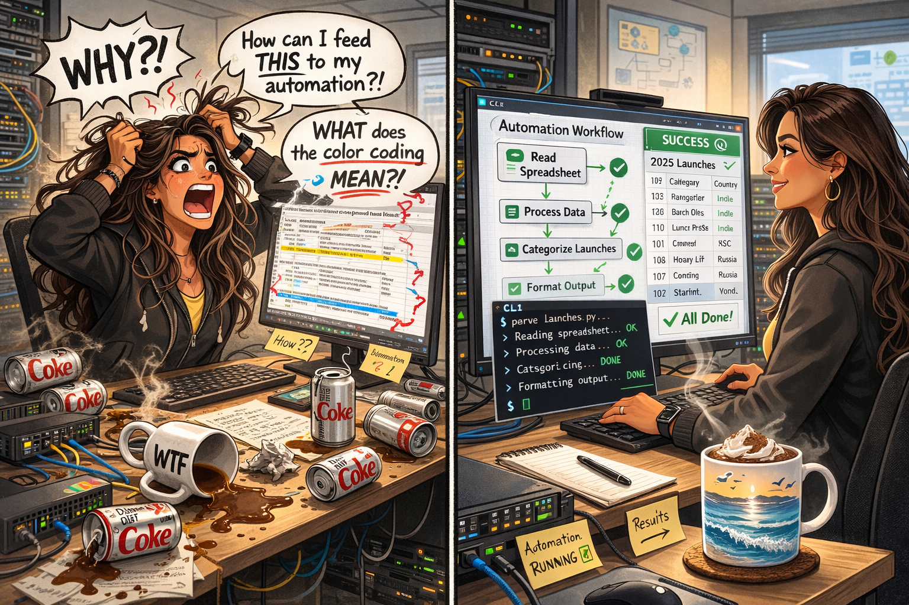
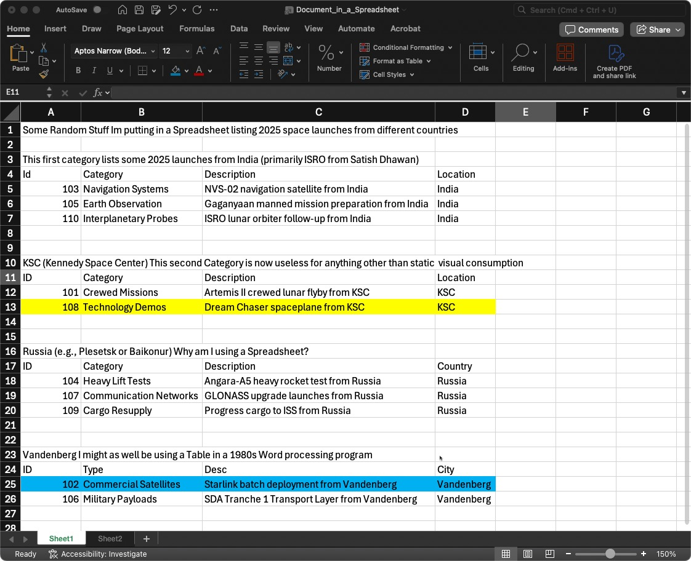

# Dont be a bobo! be a Dolt!

*Last Updated: 2026-03-04*

[View on The Gratuitous Arp](https://gratuitous-arp.net/no-bobo-es-dolt-git-version-control-mysql-database/)



When I see spreadsheets like this I want to cry and tear my hair out.  

- What if I want to select a subset? (Hide the other rows, seriously?). 

- What does the color coding mean????




### A Visceral Response

It took me a while to understand why seeing something like this made my skin crawl. 

Early in my career, I learned database design and normalization on the job.  Today you will hear people talk about schema design.  Regardless of the name, it’s really about understanding how to organize your data.  

It is a fundamental skill for anyone working with data, and I’d argue, for anyone in a technical role. This isn’t just about managing databases; it is about structuring information so it’s easy to use (especially with today’s tools) for both people and systems.

### Is our data underappreciated?

Yes. **At no time in our careers as network engineers has this been more important.**  Let me re-phrase, this was always important but we could get away with alot before. Those margins are gone.

Schema design has come a long way since I first started out but understanding what columns you need, what type of data they hold, what tradeoffs you are going to make to reduce data duplication and increase performance and workload scalability, is even more important today.  

We have to stop assuming that it is people looking at our data.  The thing is, the two things are not mutually exclusive (see below).

What do I want to see?  I want to see a description of each column and the data stored in a structured way (CSV, JSON, YAML for text based data,  even Excel if you must). 

```yaml
Launches:
  id: int           # Unique ID (101, 102...)
  launch_date: date	# Launch Date "2025-01-15" or "2025-07-20"
  category: str     # "Navigation Systems"
  description: str  # "NVS-02 navigation satellite..."
  location: str     # "India", "KSC", etc.
  note: str         # "NVS-02 mission"

```


For a Network Engineer, there is nothing more important than the data, so being comfortable organizing data is an invaluable skill (and I don't mean organizing data in the "Word in Excel" way).

So while it is not at all a surprise that my first post this year is around data (almost all my posts are ultimately about data) it is surprising that this one involves SQL.  

While I was very fortunate to have been exposed to databases and database design early on, I was never the DB Admin fully immersed in SQL.   Well its never too late to learn and while there are all kinds of interesting and new databases to handle today's data requirements you will surely run into SQL in your travels.

But basically SQL is just syntax for getting information, what grabbed my attention early this year was a database with revision control! 

More than that, a database with revision control that is very familiar to many of us working with Automation, Scripting, and dare I say it, Software Development. 

## A Database, Git style!

So let me introduce "el bobo" or in English "[Dolt](https://docs.dolthub.com/)".

One of my favorite Spanish words is "bobo" or "boboso" so when I ran acrosso Dolt and found out [how it got its name](https://www.reddit.com/r/Database/comments/cjhzzw/dolt_imagine_if_git_and_mysql_had_a_baby/), I thought, why didn't they ask me!  We could be doing:

`brew install bobo`

but alas, we will have to stick with dolt (and likely for the best as every time I hear the word, I hear my grandmother complaining !Mira este, que boboso! which loosely translates  to  "Look at this dolt!")

## So lets do that! (Si, Abuelita, miramos un boboso)

The videos below will walk you through setting up a Dolt database on one system, and remotely accessing it to initialize and update a database of launch sites.

You will use this repository
https://github.com/cldeluna/no_bobo_es_dolt

 ## Start here

 - **Easy start (get the database running)**

   Follow: [`DOLT_DB_EASY_START.md`](DOLT_DB_EASY_START.md)

   Video: [Setting up the server / Dolt DB Easy Start](https://vimeo.com/1170444154?fl=ml&fe=ec)(~13min)

   This guide walks you through installing Dolt, creating a `config.yml`, starting `dolt sql-server`, creating a database/table, inserting sample data, and making your first Dolt commit.

 - **Python workflow (manage the Dolt database with a script)**

   Follow: [`DOLT_DB_PYWORKFLOW.md`](DOLT_DB_PYWORKFLOW.md)

   Video: [Creating your Database and loading the data / Dolt DB Python Workflow for loading and manipulating data](https://vimeo.com/1170444200?fl=ml&fe=ec) (~20min)
   This video walks you through using `dolt_manage.py` (optionally with `uv`) to load/modify data from CSV, generate commits, and demonstrate recovery with Dolt revision control.

- **Dolt SQL CLI and a Branch Workflow**

​	Follow: [`DOLT_DB_PYWORKFLOW.md`](DOLT_DB_PYWORKFLOW.md)

​	Video: [A short trip down a branch](https://vimeo.com/1170444295?fl=ml&fe=ec) (~6min)
​	This video walks you through the branch/merge workflow.

#### Supporting Material

 - **Linux client (connect from Ubuntu / install MySQL client)**

   Follow: [`DOLT_LINUX_CLIENT.md`](DOLT_LINUX_CLIENT.md)

   Video: [Linux client out take](https://vimeo.com/1170692593?fl=ml&fe=ec) (~5min)

 - **Encryption / TLS (secure connections to Dolt)**

   Follow: [`DOLT_ENCRYPTION.md`](DOLT_ENCRYPTION.md)

   This guide walks you through generating certificates and configuring Dolt to require secure transport.

   
   
   Tip: The repository uses [uv](https://docs.astral.sh/uv/ "uv") and if you want to learn a bit more I hope [Ultra Valuable uv for Dynamic, On-Demand Python Virtual Environments](https://gratuitous-arp.net/dynamic-on-demand-python-venv-or-virtual-environments/ "Ultra Valuable uv for Dynamic, On-Demand Python Virtual Environments") helps.

## Final Thoughts

While database design, implementation, and operations may not be your thing....I get it..you are Network Engineer...all I suggest is that in this day and age, you think about how you are capturing, saving, and presenting your data.  Is it machine ready?  Or are you going to make some poor slob (usually my role) have to go through your data format just to be able to consume it (and I'm not even talking about the data itself!).

Just say NO! to Word in Excel ([and Visio](https://www.youtube.com/watch?v=6qDTF-rdnI0))

No seas u bobo, organiza y presenta tus datos para que puedan ser utilizados por personas y la automatización también.

Finally, check out [DoltHub](https://docs.dolthub.com/)!